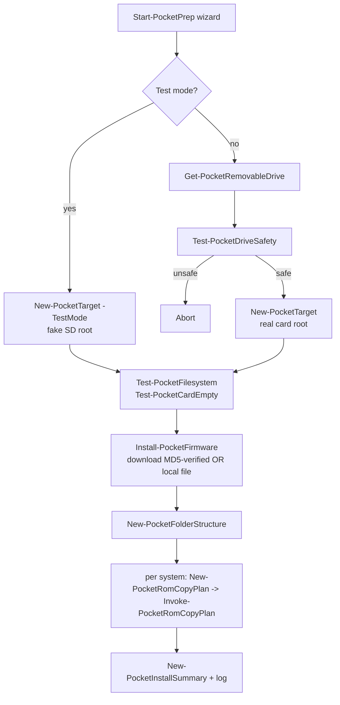

# Architecture

## Overview

The project is a **PowerShell 7 engine module** (`PocketPrep`) plus a thin
**interactive CLI wizard** (`src/Start-PocketPrep.ps1`). All real work lives in the
module as small, pure, individually testable functions. The wizard only handles
prompts and sequencing; it contains no business logic that isn't also callable
directly.

### Front-ends
Two front-ends share the same engine: a **CLI wizard** (`Start-PocketPrep.ps1`) and a
**local web UI** (`Start-PocketPrepServer` serving a static SPA from `web/` over a
localhost-only, token-secured HTTP API). The API dispatcher and auth check are pure
functions (`Invoke-PocketApiRoute`, `Test-PocketApiRequest`), so the whole API is
unit-tested without sockets. See [SECURITY.md](SECURITY.md).

#### Web server concurrency model
The web server processes requests on a **single thread** (`HttpListener.GetContext` in a
loop). This is a deliberate choice for a **single-user, localhost** tool: it keeps the
state model trivially safe (no locks around the file-writing engine) at the cost of not
serving requests concurrently. The practical implication is that a long operation
(firmware/core download, ~5–60 s) blocks other requests while it runs. This is mitigated:

- All downloads have **timeouts and bounded retry** (`Invoke-PocketHttp`), so a request
  can never hang forever.
- The web UI shows a **clear, specific in-progress message** for every long operation, so
  it cannot appear silently hung, and the triggering action is what the user is waiting on.

True concurrency (async accept + a worker pool, or job-id + polling) is intentionally
**deferred** — it would add shared-state synchronisation risk for marginal benefit on a
single-user tool. Tracked as a P2 follow-up for if/when multi-client responsiveness
matters. The CLI wizard (no server) is always available for fully headless use.

### Cross-platform
The engine runs on Windows, Linux, and macOS (PowerShell 7). The only OS-specific code
is drive enumeration, isolated in `Get-PocketRawDriveData`, which delegates to pure
parsers (`ConvertFrom-PocketLsblk`, `ConvertFrom-PocketSystemProfiler`) that are
fixture-tested. Volumes are identified by `RootPath` (mountpoint on *nix, `X:\` on
Windows); safety rejects platform-appropriate system volumes.

### Why PowerShell 7 (not C#/.NET or a heavyweight GUI)

- The core logic (drive filtering, safety rules, validation, path generation,
  copy planning, manifest parsing) is **pure data transformation** and is fully
  unit-testable with Pester — including in CI on Linux, with no Windows hardware.
- Users need **one dependency** (PowerShell 7), not a compiled runtime.
- The only Windows-specific piece (live drive enumeration via the Storage/CIM
  cmdlets) is **isolated behind a provider boundary**, so tests inject fake data.
- A GUI (WPF, or a .NET front-end) can be layered on the *same engine* later
  without rewriting logic. Shipping an untested Windows-only GUI now would violate
  the project's "don't claim untested" rule. See [ROADMAP.md](ROADMAP.md).

## Components

```
src/PocketPrep/
  Public/    one exported function per file (the engine API)
  Private/   helpers: drive provider (CIM), MD5, shared constants
src/Start-PocketPrep.ps1   interactive wizard (UI layer only)
manifests/                 firmware.json, systems.json, JSON schemas (data layer)
tests/                     Pester suite (one file per component)
scripts/                   Run-Tests, Install-DevDeps, Build-Release
```

Layer separation:

| Layer | Where |
|---|---|
| UI (CLI) | `Start-PocketPrep.ps1`, `PocketPrep.cmd` |
| UI (web) | `Start-PocketPrepServer` + `web/` (SPA); `Start-PocketPrepWeb.ps1`, `scripts/pocketprep.sh` |
| Web API/auth | `Private/Invoke-PocketApiRoute`, `Private/Test-PocketApiRequest` (pure) |
| Drive detection | `Get-PocketRemovableDrive` + `Private/Get-PocketRawDriveData` (Windows CIM / Linux `lsblk` / macOS `system_profiler`, via pure `ConvertFrom-Pocket*` parsers) |
| Validation | `Test-PocketDriveSafety`, `Test-PocketFilesystem`, `Test-PocketCardEmpty` |
| Firmware | `Get-PocketFirmwareManifest`, `Resolve-PocketFirmwareRelease`, `Test-PocketFirmwareFile`, `Install-PocketFirmware` |
| ROM copy | `Get-PocketSystem`, `New-PocketRomCopyPlan`, `Invoke-PocketRomCopyPlan` (batched + `-OnProgress`) |
| ROM platforms | `Get-PocketImportablePlatform` (installed-core platforms), `Get-PocketKnownPlatform` (systems + installed + catalog + custom) |
| ROM library mgmt | `New-/Invoke-PocketRomOrganizePlan` (subfolders + filename shortening), `Get-PocketRomRegionDuplicate` + `Invoke-PocketRomRegionDedupe` (region 1G1R → reversible quarantine), `Test-PocketReservedRomPath` |
| Favourites | `Get-/Save-PocketFavorite`, `Sync-PocketFavorite` (symlink-or-copy into `!Favorites`), `Test-PocketSymlinkSupport`, `Private/Get-PocketFavoritesFolder` |
| ROM config / rescan | `Get-/Save-PocketRomConfig`, `Invoke-PocketRomRescan` (`pocketprep/rom-sources.json`) |
| Profiles | `Export-PocketProfile` / `Import-PocketProfile` (portable setup: cores + ROM sources + favourites, references only) |
| Card insight | `Get-PocketCardSummary`, `Get-PocketInstalledCore`, `Get-PocketCoreRequiredFile` (data.json BIOS/required files), `Get-PocketBiosStatus`, `Get-PocketDiskSpace`, `Import-PocketUsedCard` (onboard), `Get-PocketCardCleanup`/`Invoke-PocketCardCleanup` (safe leftovers cleanup) |
| Cores | `Get-PocketCoreManifest`, `Resolve-PocketCore`, `Test-PocketCoreZip`, `Install-PocketCore`, `Install-PocketCoreSet` (bulk/subset), `Get-PocketCoreUpdateStatus`, `Update-PocketCore`, `Test-PocketCoreIntegrity`, `Repair-PocketCore` |
| Folders | `New-PocketFolderStructure` |
| Saves / removal | `Backup-PocketSaves`, `Restore-PocketSaves`, `Clear-PocketCard` (guarded), `Dismount-PocketDrive` (flush + best-effort eject) |
| Config/data | `manifests/*.json` (+ `cores-supplement.json`) |
| Logging | `New-PocketLogger`, `Write-PocketLog` |
| Reporting | `New-PocketInstallSummary` |

## Data flow



## Key design choices

- **Plan/execute split for ROMs.** `New-PocketRomCopyPlan` is pure and returns a
  plan; `Invoke-PocketRomCopyPlan` performs it. This makes dry-run trivial and the
  matching logic testable without copying anything.
- **Provider boundary for hardware.** `Get-PocketRemovableDrive -DataProvider {…}`
  accepts injected data; the default provider is the only code that calls CIM.
- **Manifest-driven everything.** Firmware URLs/checksums and system definitions are
  JSON, validated on load, so non-developers can update them.
- **Non-destructive by construction.** No function deletes, formats, or repartitions.
  The most that happens is `Copy-Item` into a folder and `New-Item` for directories.

## Error handling

Functions throw with specific, actionable messages (missing manifest field, MD5
mismatch, unsafe drive, missing source folder). The wizard catches per-step failures
(e.g. firmware download) and continues where sensible, logging the error.

## Logging

`New-PocketLogger` returns an object holding a file path and an in-memory entry list;
`Write-PocketLog` appends timestamped `[LEVEL] message` lines to both. The in-memory
list lets tests assert on logged actions. Secrets are never logged (there are none).

## Testing model

See [testing.md](testing.md). Every pure component has a Pester file; an end-to-end
test runs the whole flow against a fake SD root.

## Future extension points

- `manifests/cores.json` + a core installer (issue #13).
- A GUI front-end reusing the engine API.
- Additional systems by editing `systems.json`.
